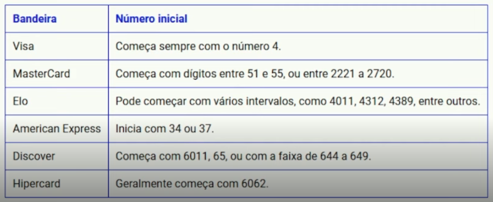

# Credit Card Brand Validator 💳

Credit Card Brand Validator with GitHub Copilot.

<h1 align="center">


_**DIO Challenge**_
</h1>

## Goal
Inputar um número de cartão de crédito e validar qual a bandeira daquele cartão.

## Descrição

Este projeto é uma solução para validar a bandeira de um cartão de crédito com base no número do cartão. A função `getCardBrand` recebe um número de cartão de crédito como entrada e retorna a bandeira correspondente (VISA, MasterCard, ELO, American Express, Discover ou Hipercard) ou "Unknown" se a bandeira não for reconhecida.

## Como Funciona

A função `getCardBrand` utiliza expressões regulares para identificar a bandeira do cartão de crédito. As expressões regulares são armazenadas em um objeto `cardPatterns`, onde as chaves são os nomes das bandeiras e os valores são as expressões regulares correspondentes. A função itera sobre as entradas do objeto e verifica se o número do cartão corresponde a algum dos padrões.

Para a bandeira ELO, foi utilizada uma função auxiliar `isElo` que verifica se o prefixo do número do cartão está dentro de um intervalo específico de prefixos válidos.

### Exemplo de Uso

```javascript
const { isElo } = require("./helper/check-elo");

function getCardBrand(cardNumber) {
    const cardPatterns = {
        "VISA": /^4[0-9]{12}(?:[0-9]{3})?$/,
        "MasterCard": /^(5[1-5][0-9]{14}|2(2[2-9][0-9]{2}|[3-6][0-9]{3}|7[01][0-9]{2}|720[0-9]{2})[0-9]{12})$/,
        "American Express": /^3[47][0-9]{13}$/,
        "Discover": /^(6011|65|64[4-9])[0-9]{12,15}$/,
        "Hipercard": /^606282[0-9]{10}$/
    };

    if (isElo(cardNumber)) return "ELO";

    for (const [brand, pattern] of Object.entries(cardPatterns)) {
        if (pattern.test(cardNumber)) return brand;
    }

    return "Unknown";
}

const cardNumber = "3452 095354 01252".replace(/\s/g, "");
console.log(getCardBrand(cardNumber)); // Output: American Express
```

### Padrões de Cartões Suportados

- **VISA**: Começa com 4
- **MasterCard**: Começa com dígitos entre 51 e 55, ou entre 2221 e 2720
- **ELO**: Começa com vários intervalos (como 4011, 4312, 4389, etc)
- **American Express**: Começa com 34 ou 37
- **Discover**: Começa com 6011, 65 ou com a faixa de 644 a 649
- **Hipercard**: Começa com 6062

<h1 align="center">

</h1>

## Como Executar

1. Clone o repositório:
    ```sh
    git clone https://github.com/ViihNeris/credit-card-brand-validator.git
    ```

2. Navegue até o diretório do projeto:
    ```sh
    cd credit-card-brand-validator
    ```

3. Execute o código:
    ```sh
    node src/index.js
    ```

## Contribuição

Sinta-se à vontade para contribuir com melhorias para este projeto. Para isso, siga os passos abaixo:

1. Faça um fork do projeto
2. Crie uma branch para sua feature (`git checkout -b feature/nova-feature`)
3. Commit suas mudanças (`git commit -m 'Adiciona nova feature'`)
4. Faça um push para a branch (`git push origin feature/nova-feature`)
5. Abra um Pull Request

## GitHub Copilot

Este projeto foi desenvolvido com a ajuda do ***GitHub Copilot***, que auxiliou na geração de código e na entrega deste desafio.

***[Bootcamp Microsoft AI for Tech - GitHub Copilot](https://web.dio.me/track/github-copilot)***

## Obrigada! ✅
Acompanhe mais projetos meus em https://github.com/ViihNeris 😉💜👩🏻‍💻
